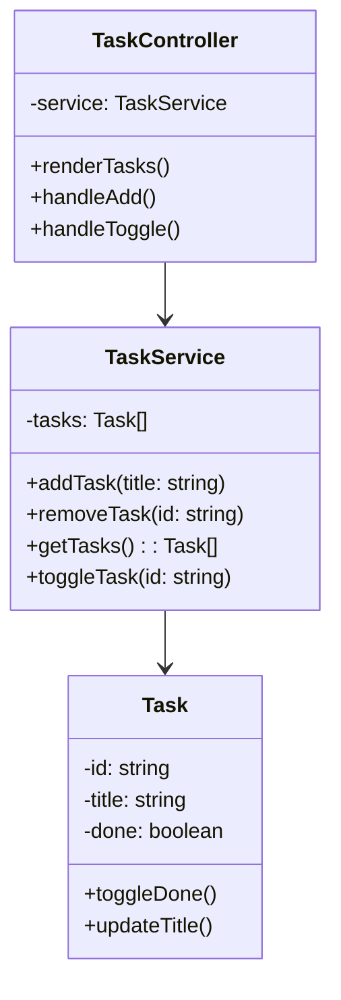

# ⏳ Chronos

**Chronos** es un gestor de tareas de escritorio, desarrollado con **TypeScript + Electron**, pensado para que tomes el control de tu tiempo.

Organiza, planifica y ejecuta tus tareas diarias con una interfaz simple pero poderosa. Chronos te acompaña en tu jornada como el guardián del tiempo.

---

## 📐 Diagrama de Clases



📁 Estructura del Proyecto
```
src/
├── main/               
├── renderer/           
│   ├── views/
│   ├── controllers/
│   └── renderer.ts
├── core/
│   ├── models/
│   ├── services/
│   └── utils/
```

🚀 Instalación
```
npm install
npm run build
npm start
```

📜 Licencia
Este proyecto está bajo la licencia Creative Commons Attribution-NonCommercial 4.0 International (CC BY-NC 4.0).

> Puedes ver, modificar y compartir el código, siempre que me des crédito y no lo uses con fines comerciales.

[Ver licencia completa] (https://creativecommons.org/licenses/by-nc/4.0/)

🔮 Futuras mejoras
- Temporizador Pomodoro ⏲️
- Notificaciones y recordatorios 🔔
- Sincronización con calendario 📅
- Mejoras en interfaz y UX 🎨

📬 Contacto
Creado por Ulisse Buccella — [(https://www.linkedin.com/in/ulisse-buccella)]
